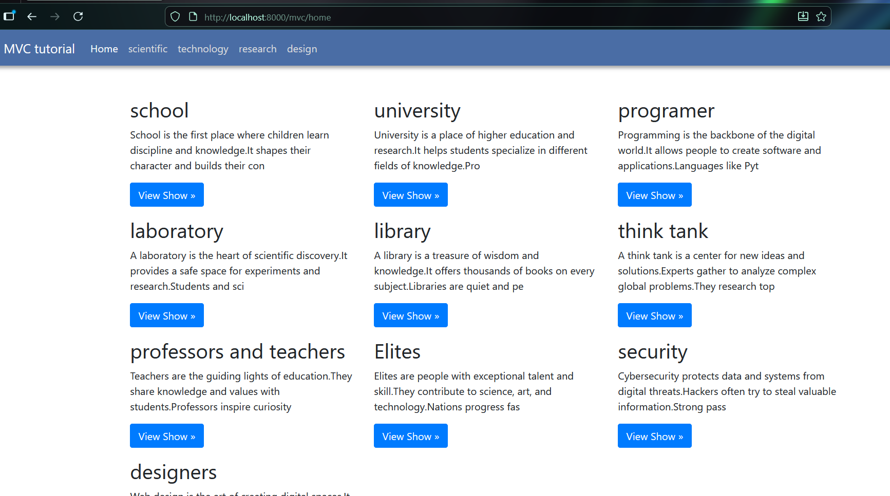
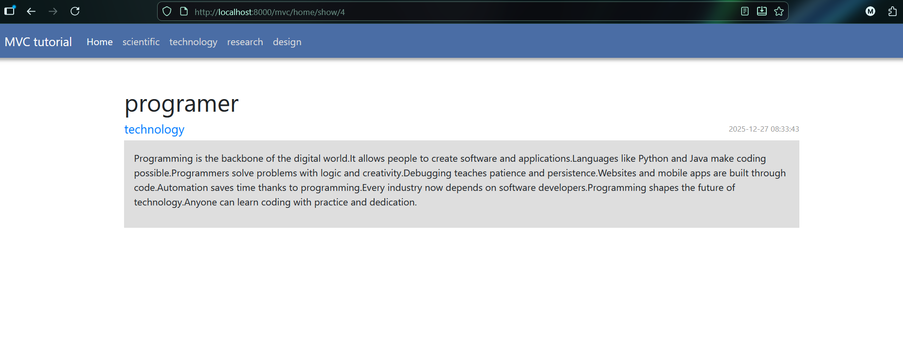
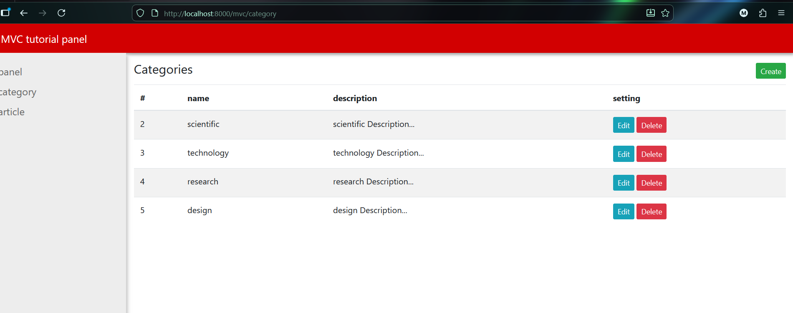
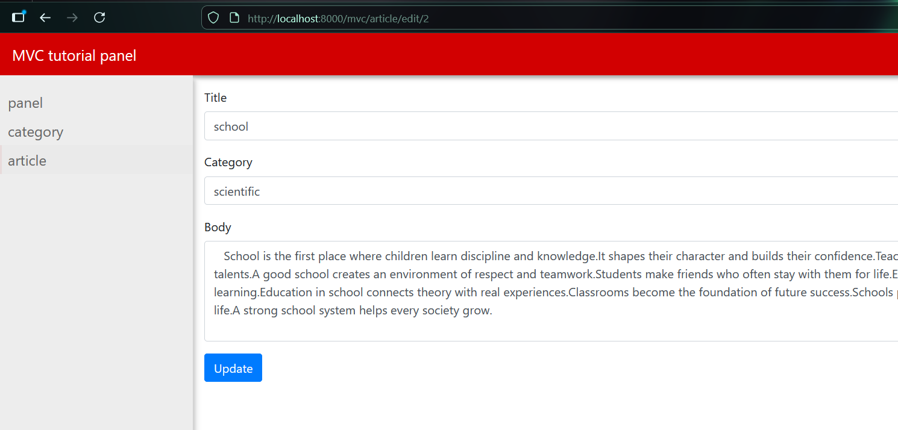
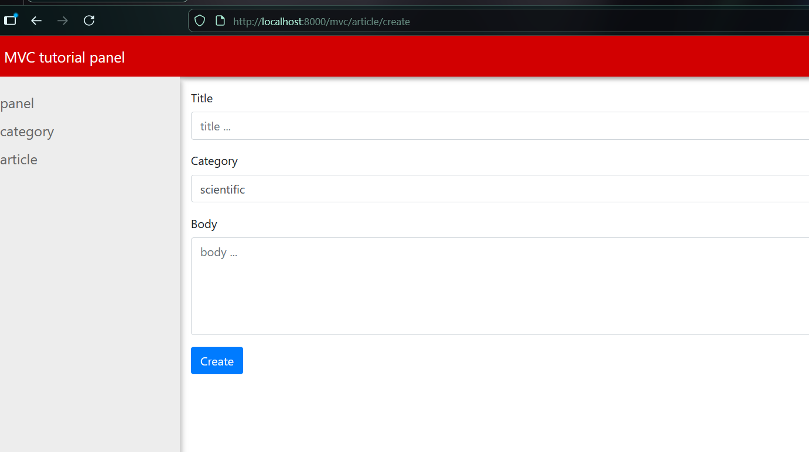

# MVC Blog Blog (Educational Project)

This project is built on a lightweight custom MVC framework called Tiny-MVC,
developed from scratch using Object-Oriented PHP for educational purposes.
---

## Screenshots

<p align="center">
  
</p>

<p align="center">
  
</p>

---

### Admin Panel

<p align="center">
  
</p>

<p align="center">
  
</p>

<p align="center">
  
</p>

<p align="center">
  
</p>

## Installation & Setup

1. Clone the repository:

2. Navigate to the project directory and run the PHP built-in server:

```php -S localhost:8000```

3. Important Notes:

-- Do not use only port ``8000``

-- You must manually update the server URL inside the project files if needed

4. Import the provided SQL file into your MySQL database.

5. Open the config.php file and set your database credentials: ``Password``

6. Open the project in your browser:

```http://localhost:8000/mvc/home```


7. Run the project locally on Desktop (Localhost).

Purpose of This Project

This project was created for educational purposes only to demonstrate:

MVC Architecture

Object-Oriented Programming (OOP) in PHP

Clean project structure

CRUD operations for categories and articles
